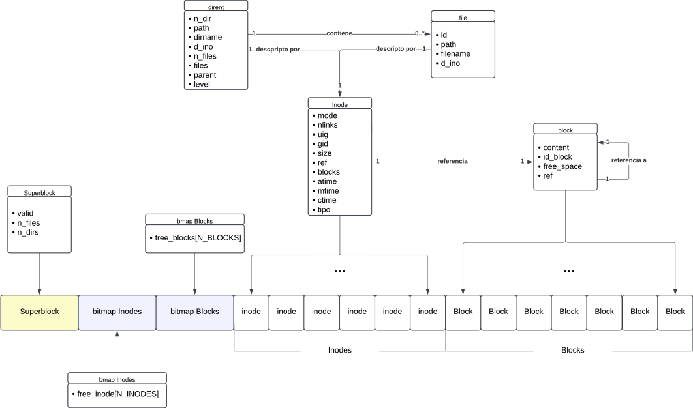

# fisop-fs

## Estructura FS



Esta conformado por un superbloque, el cual guarda la metadata de todo el file system como el numero de files o directorios y tiene una variable de "configuracion" que indica que se cargo correctamente.

Luego tenemos los bitmaps, uno para los bloques y otro para los inodos. Esto se encargan de mostrar si un bloque o inodo se encuentra libre, tienen un array llamado free_blocks o free_inodes donde indican con cero si un bloque o inodo esta libre o un uno se esta ocupado.

Los inodos guardan la metadata de un file o un directorio, el modo con el que se creo, hora de modificacion o apertura, group id (gid), etc. En el caso de referenciar un file guardara pedazos de metadata importantes para estos como el numero de links, el size, referencia al primer bloque de datos y la cantidad de bloque de datos. En nuestro file system soporta un total de 64 indodos.

Los directorios guardan su numero de direcotrio, path, nombre del directorio, cantidad de files, un array con referencia al id de los files, id de su directorio padre y el id de su inodo. Nuestro file system es 'flat', por lo que limitamos a un unico nivel de recursion en los directorios, lo cual consideramos importante a la hora de decidir el esquema a utilizar, dado que tiene una complejidad de implementacion baja y el numero de archivos y directorios tambien lo es.

Los file guardan un id, su path, nombre del archivo y id del inodo que referencian.

Por ultimo, los bloques que son referenciados por el inodo de un file y guardan un contenido, su id, la cantidad de espacio libre restante y la referencia al proximo bloque de datos del file, será '-1' si no hay mas bloques. Pueden guardar contenido hasta 256 bytes y hay 256 bloques en nuestro file system.

## Busqueda por path

Dado las estructuras definidas para el file system en memoria:

```c
struct superblock *sb;
struct bmap_blocks *bitmap_blocks;
struct bmap_inodes *bitmap_inodes;
struct block *blocks;
struct inode *inodes;
struct file *files;
struct dirent *dirs;
```

Y al tener informacion sobre la metadata de todo el file system en nuestro superbloque, si queremos buscar un directorio por su path debemos realizar un loop por el array de dirs, hasta el numero de directorios que indique el superbloque, e ir comparando el path que buscamos con el path del directorio.
Para los files seria muy similar, solo que usariamos el numero de files del superbloque y un loop por el array de files.
Decidimos esta implementacion ya que al tener un file system flat, no habria mas de un subnivel de subdirectorios, por lo que los files estan todos al alcance.

## Serializacion de los archivos

Como nuestro file system existe en memoria RAM durante su ejecucion debemos tener una forma de que los files o directorios persistan al montar o desmontar el file system.
Asi el file system se representa con un archivo .fisopfs, el nombre del archivo puede ser especificado en el montaje del file system sino en este caso se creara un archivo con el nombre "persistence_file.fisopfs".
De este archivo se lee toda la informacion del file system para su montaje y se guardara toda la informacion ante un desmontaje.

## Ejecucion de Tests

1. Montar el file system en la primera terminal con la flag '-f'.
2. Ya en la segunda terminal, antes de entrar al mount point se debe ejecutar
   `chmod +x testVFS.sh`
   Para crear el ejecutable de los tests.
3. Para ejecutarlos
   `./testVFS.sh`

IMPORTANTE: No entrar al mount point en la segunda terminal, ya que los tests se encargan de primero entrar allí.

## Otra informacion importante

Se creo la operacion utimens vacia, ya que FUSE lanzaba un error al querer manipular un archivo. Por consejo del profesor Patricio, creamosla operacion vacia para FUSE no lanzara este error.
